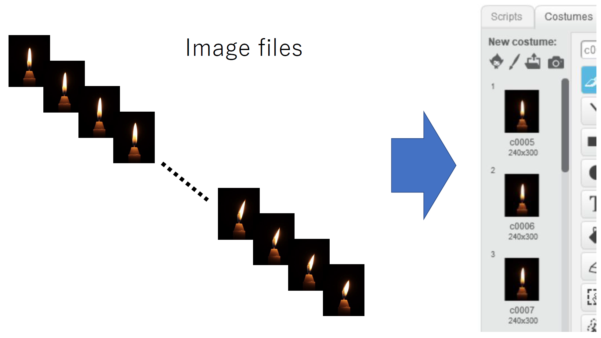
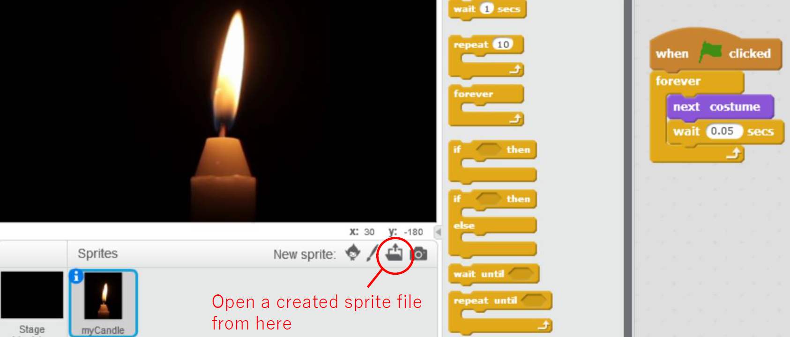

# Scratch sprite generator for Windows/Mac/Linux

[(Japanese)](README.md)

Convert a sequence of images (png, svg) to a sprite file that can be imported to your Scratch project.

In Scratch 2, [Upload costume from file] allows you to upload multiple costumes at once but does not maintain the original order of image files. In addition, it seems Scratch3 does not allow multiple upload of costumes. Using the sprite generator tool introduced here, you can create a sprite that has a lot of costumes in the same order as the original image-name order. This can be utilized for projects using, for example, realistic animations. ([Demo video](#demovideo))




## Usage

1. Download [the archive of this project](https://github.com/memakura/seq2sprite/archive/master.zip).
1. Open the archive file. Copy or move `img` folder and script files starting from `seq2sprite` (`seq2sprite.bat`, `seq2sprite-s2.bat`, `seq2sprite-s3.bat`, and `seq2sprite.sh`) to other folder, for example, a new folder under your `Documents` folder.
    - In what follows, we assume that **a folder named `seq2sprite` is created under the `Documents` folder** and that `img` and script files are copied there.
    - `img` folder contains sample images.
    - While we will use either the batch files (end with `.bat`) or the shell script (end with `.sh`), we here copy all the scripts for simplicity.
1. Open `seq2sprite` folder.
1. Replace the sample image sequence in `img` folder with your image sequence. (You can first try with the original sample files.)
    - If you want to keep a used `img` folder, change the name to backup it and create a new empty `img` folder.
    - The base name of each file (for example, c0005 of c0005.png) is used as a costume name.
    - All the image sizes are assumed to be the same 240x300. If you want to change the size, please see <a href="#imgsize">here</a>.
1. Run an appropriate script depending your environment, and it generates a sprite file. See below for details. **It is recommended to rename the generated sprite file so that it is not overwritten.**
    
### Windows (Use seq2sprite.bat)

1. Double click `seq2sprite-s2.bat` (or `seq2sprite-s3.bat` for Scratch 3). 
    - If you are using Windows 10, you will see a warning message for the first time. Click "More info" and then select "Run anyway".
    - **Wait until the opened (black) window is automatically closed.**
    - Do not run the script again before the window is closed.
1. A folder named `work` will be created.  If you are using Windows10, `work.sprite2` (or `work.sprite3`) will also be created, and it can be imported to Scratch.  
    
    (**The following steps are for Windows 7, 8, 8.1 users**)
1. Double click `work` folder and select all the files inside.
1. Move cursor on the selected files and open a menu by right click.
1. Select "Compressed (zipped) Folder" option from the "Send To" options. It will generate `work.zip`.
1. Change the name of `work.zip` to `work.sprite2` or `work.sprite3` depending on the version of Scratch, and move the file oudside of the `work` folder.

### Mac, Linux, Windows bash (mingw, cygwin, subsystem) (Use seq2sprite.sh)

**(Note) zip command is required. In addition, md5sum command is required for Scratch 3. zip is usually preinstalled but md5sum should be installed by yourself (explained later).**

1. Open bash (terminal). If you use Mac, type "terminal" from Launchpad or Spotlight search.
1. Change the current folder by typing the following command. 
   ```
   cd /Users/<user name>/Documents/seq2sprite
   ```
   - Press `return` after you typed. `<user name>` should be replaced by your user name of the PC.
   - Command `cd` means change directory (folder). You can also use `pwd` and `ls` to check the path to the current folder and files/folders under the current folder, respectively. `ls` should show `img/` and `seq2sprite.sh`.
1. Run the script by typing one of the following two commands. Note the last number should be appropriately set depending on the version of Scratch.
   ```
   ./seq2sprite.sh -2  (For Scratch2. `work.sprite2` will be generated.)
   ./seq2sprite.sh -3  (For Scratch3. `work.sprite3` will be generated.)
   ```

#### Install md5sum to Mac

1. Install [Homebrew](https://brew.sh/).
1. Open terminal and run the following command:
   ```
   brew install md5sha1sum
   ```

### Open a created sprite file from Scratch

#### From Scratch 2

1. Select "Upload sprite from file" icon in the "New Sprite" section (see the figure below). Load a created file (`work.sprite2`).

   

1. A sprite named "myCandle" will appear in the "Sprites" subwindow. You can change the sprite name by clicking the top-left blue "i" icon.

#### From Scratch 3

- Hover the mouse cursor on the "cat icon" in the sprite subwindow. Then a menu list will appear. Select the top icon [Upload], and open `work.sprite3`.

<a name="demovideo">

### Demo Video

<iframe width="522" height="315" src="https://www.youtube.com/embed/7QLjaB54ZRM?rel=0" frameborder="0" allow="autoplay; encrypted-media" allowfullscreen></iframe>


<a name="imgsize">

## Use different image size or SVG files

If each image size is different from 240 x 300, open a script file (`seq2sprite.bat` or `seq2sprite.sh`), and change the following lines. Recommended numbers are the half of your image size (each of width and height).

```
    "rotationCenterX": 120,
    "rotationCenterY": 150
```

If you want to use svg files, change `EXT=png` to `EXT=svg`.


## About the sample images (credit)

Candle images used on this web page and the sample images in `img` folder are from the video
"Candle flame being blown out 1 | Free Stock Footage"
by DL Stock Footage. They also provide several other nice video clips. 

- [https://www.youtube.com/watch?v=dlHyoPC0hcw](https://www.youtube.com/watch?v=dlHyoPC0hcw)
- [https://www.facebook.com/dlstockfootage/](https://www.facebook.com/dlstockfootage/)

## About other video clips

[https://www.techradar.com/news/the-best-free-stock-video-sites](https://www.techradar.com/news/the-best-free-stock-video-sites) introduces many free stock video sites. For example, [Videvo (Free Stock Video Footage)](https://www.videvo.net/) has many useful videos with a free license ([see here for the details of license information](https://www.videvo.net/faqs/)).
