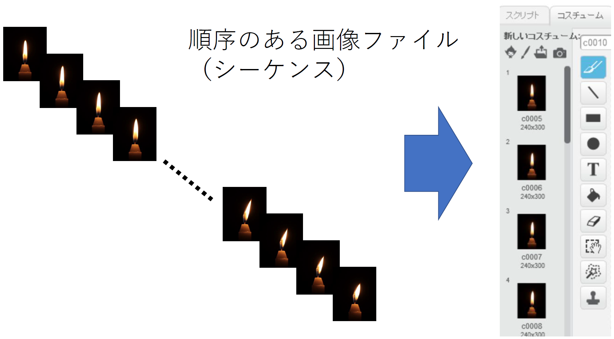
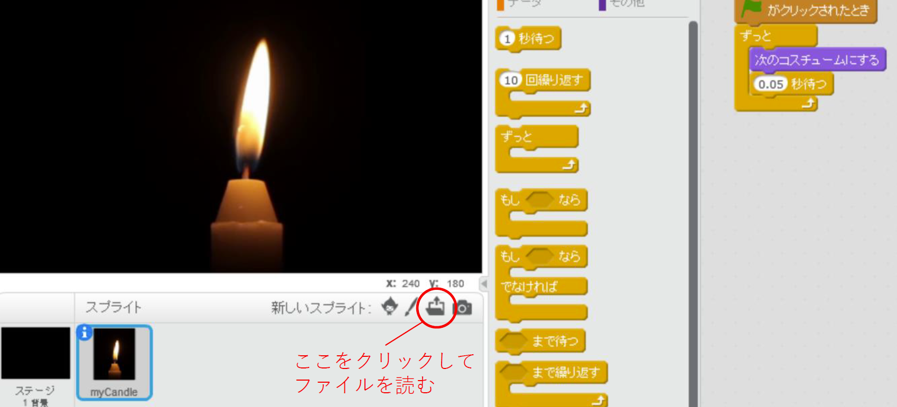

# 画像ファイルからScratchスプライトを作るツール (Win/Mac/Linux)

[(English)](README-en.md)

スクラッチ2.0の「ファイルから新しいコスチュームをアップロード」でたくさんの<ruby>画像<rp>（</rp><rt>がぞう</rt><rp>）</rp></ruby>を読むと、<ruby>順序<rp>（</rp><rt>じゅんじょ</rt><rp>）</rp></ruby>がばらばらになって<ruby>大変<rp>（</rp><rt>たいへん</rt><rp>）</rp></ruby>です。スクラッチ3.0では（今のところ？）<ruby>複数<rp>（</rp><rt>ふくすう</rt><rp>）</rp></ruby>のコスチュームをまとめてアップロードすることはできないようです。
ここで<ruby>紹介<rp>（</rp><rt>しょうかい</rt><rp>）</rp></ruby>する seq2sprite（シーケンス・トゥー・スプライト）というツールを使うと、元の画像ファイル名と同じ順に、多くのコスチュームを持つようなスプライトを作ることができます。たとえばスクラッチでアニメーションを使ったプロジェクトを作るときなどに役に立ちます。以下はロウソクを使ったデモです。（[他のデモビデオ](#demovideo)）

<iframe width="522" height="315" src="https://www.youtube.com/embed/7QLjaB54ZRM?rel=0" frameborder="0" allow="autoplay; encrypted-media" allowfullscreen></iframe>

png か svg という画像ファイル<ruby>形式<rp>（</rp><rt>けいしき</rt><rp>）</rp></ruby>を使えます。スクラッチ2 と スクラッチ3 のどちらにも<ruby>対応<rp>（</rp><rt>たいおう</rt><rp>）</rp></ruby>しています。




**なぜ seq2sprite という名前なの？** ビデオはパラパラマンガと同じで、1コマ目、2コマ目、・・・のような<ruby>順番<rp>（</rp><rt>じゅんばん</rt><rp>）</rp></ruby>のついた画像でできています。
そんな順序のある複数<ruby>枚<rp>（</rp><rt>まい</rt><rp>）</rp></ruby>の画像を、<ruby>画像列<rp>（</rp><rt>がぞうれつ</rt><rp>）</rp></ruby>や画像シーケンス (image sequence) と<ruby>呼<rp>（</rp><rt>よ</rt><rp>）</rp></ruby>びます。「画像シーケンスをスプライトへ (an image <u>seq</u>uence <ruby><u>to</u><rp>（</rp><rt>とぅー</rt><rp>）</rp></ruby> a <ruby><u>sprite</u><rp>（</rp><rt>すぷらいと</rt><rp>）</rp></ruby>)」を<ruby>略<rp>（</rp><rt>りゃく</rt><rp>）</rp></ruby>して seq2sprite としています。（two の発音が to と同じなので、to の当て字で数字の 2 を使っています。）


## かんたんな使い方の<ruby>説明<rp>（</rp><rt>せつめい</rt><rp>）</rp></ruby>

コスチュームにしたい複数枚の画像を `img` という名前のフォルダに入れておき、ここで紹介するスクリプトを実行すると、スクラッチでスプライトとして読み<ruby>込<rp>（</rp><rt>こ</rt><rp>）</rp></ruby>めるファイルが<ruby>出来上<rp>（</rp><rt>できあ</rt><rp>）</rp></ruby>がります。以下では使い方の詳しい<ruby>手順<rp>（</rp><rt>てじゅん</rt><rp>）</rp></ruby>を説明します。

（スプライトファイルのしくみ）Scratch 2, 3 のスプライトファイルは、画像ファイルと `sprite.json` というテキストファイルをまとめて zip という形式で<ruby>圧縮<rp>（</rp><rt>あっしゅく</rt><rp>）</rp></ruby>したものです。

## 使い方

1. まず[このプロジェクトのファイル](https://github.com/memakura/seq2sprite/archive/master.zip)をダウンロードします。
1. ダウンロードしたファイルを開き、`img`というフォルダと、`seq2sprite` から始まるファイル（`seq2sprite.bat`, `seq2sprite-s2.bat`, `seq2sprite-s3.bat`, `seq2sprite.sh`）を<ruby>適当<rp>（</rp><rt>てきとう</rt><rp>）</rp></ruby>な場所にコピーしておきます。
    - Windowsの「ドキュメント」や Macの「<ruby>書類<rp>（</rp><rt>しょるい</rt><rp>）</rp></ruby>」に適当なフォルダを作って入れておくとよいです。**以下の説明では `seq2sprite` という名前のフォルダを作ったとします．**
    - `img` にはサンプル画像が入っています。
    - ファイルが `.bat` で終わるものか、`.sh` で終わるもののどちらかを使いますが、ややこしいのですべてコピーしておくことにします。
1. フォルダやスクリプトを入れたフォルダ `seq2sprite` を開きます。
1. `img` フォルダの中に pngファイルを複数枚入れておきます（まずはサンプルをそのまま使ってみてください）。
    - <ruby>各<rp>（</rp><rt>かく</rt><rp>）</rp></ruby>ファイル名から<ruby>拡張子<rp>（</rp><rt>かくちょうし</rt><rp>）</rp></ruby>（.pngなど）を<ruby>除<rp>（</rp><rt>のぞ</rt><rp>）</rp></ruby>いた部分（c0005.png なら c0005）がそれぞれコスチューム名になります。
    - 画像サイズは全て同じ 240x300 を<ruby>想定<rp>（</rp><rt>そうてい</rt><rp>）</rp></ruby>しています。サイズを変える場合は[こちら](#imgsize)を見てください。
1. Windows や Mac といった自分のPCの<ruby>環境<rp>（</rp><rt>かんきょう</rt><rp>）</rp></ruby>に合ったスクリプトを実行すると、スプライトファイルができます。<ruby>詳細<rp>（</rp><rt>しょうさい</rt><rp>）</rp></ruby>は<ruby>以下<rp>（</rp><rt>いか</rt><rp>）</rp></ruby>を見てください。
    - スクラッチ2用は `.sprite2`、スクラッチ3用は `.sprite3` という拡張子のファイルをスクラッチから読み込むことができます。
    - できたファイルは、上書きしないように名前を変えておくのをおすすめします。拡張子の部分は変えないでください。

### Windows の場合 (seq2sprite.bat を<ruby>利用<rp>（</rp><rt>りよう</rt><rp>）</rp></ruby>)

**ファイルエクスプローラの [<ruby>表示<rp>（</rp><rt>ひょうじ</rt><rp>）</rp></ruby>] で [ファイル名<ruby>拡張子<rp>（</rp><rt>かくちょうし</rt><rp>）</rp></ruby>を表示] にチェックを入れておくと<ruby>便利<rp>（</rp><rt>べんり</rt><rp>）</rp></ruby>です。**

1. `seq2sprite-s2.bat`（スクラッチ3の場合は `seq2sprite-s3.bat`）をダブルクリックして実行します。
    - ダウンロードしてから初めて実行するときは、Windows 10 だと「WindowsによってPCが<ruby>保護<rp>（</rp><rt>ほご</rt><rp>）</rp></ruby>されました」と表示されるので、「詳細<ruby>情報<rp>（</rp><rt>じょうほう</rt><rp>）</rp></ruby>」をクリックしてから「実行」を<ruby>選<rp>（</rp><rt>えら</rt><rp>）</rp></ruby>んでください。
    - **黒い画面が開きますが、勝手に閉じるまで待ってください。**
    - 同時に何回も実行しないでください。
1. `work` というフォルダが出来上がります。Windows 10 を使っている場合は `work.sprite2`（スクラッチ3用は `work.sprite3`）というファイルも出来上がるので，これをスクラッチから読み込めます。  
    
    **（以下は Windows 7, 8, 8.1 を使用している場合のみ）** 
1. 出来上がった `work` フォルダをダブルクリックし、中にあるすべてのファイルを<ruby>選択<rp>（</rp><rt>せんたく</rt><rp>）</rp></ruby>します。
1. 選択中のファイルにマウスカーソルを合わせ、右クリックを<ruby>押<rp>（</rp><rt>お</rt><rp>）</rp></ruby>してメニューを表示します。
1. メニューから [送る(N)] の [圧縮 (zip 形式)フォルダー] を選択します。すると、`work.zip` が出来上がります。
1. スクラッチ2では、これを `work.sprite2`に、スクラッチ3では `work.sprite3` という名前に変えて、**`work` フォルダの外に置いておきます**。


### Mac や Linux、Windows の bash 環境 (subsystem, mingw, cygwin) を使う場合 (seq2sprite.sh を利用)

**（注意）zip というコマンドが<ruby>必要<rp>（</rp><rt>ひつよう</rt><rp>）</rp></ruby>です。
さらに Scratch 3 では md5sum というコマンドも使います。zipは<ruby>最初<rp>（</rp><rt>さいしょ</rt><rp>）</rp></ruby>から入っていることが多いです。md5sum は、Macであれば別にインストールする必要があります（あとで説明）。**

1. bash の使えるターミナルを開きます。(Macは Launchpad や Spotlight<ruby>検索<rp>（</rp><rt>けんさく</rt><rp>）</rp></ruby>で、ter.. ぐらいを打ち<ruby>込<rp>（</rp><rt>こ</rt><rp>）</rp></ruby>むとターミナルを<ruby>選<rp>（</rp><rt>えら</rt><rp>）</rp></ruby>べます。）
1. スクリプトや `img` フォルダのある場所に行きます。Macだと、[書類] の下に `seq2sprite` というフォルダを作成してコピーしたのであれば、以下を打ち込んでフォルダを移動します。
   ```
   cd /Users/<ユーザ名>/Documents/seq2sprite
   ```
    - <ruby>最後<rp>（</rp><rt>さいご</rt><rp>）</rp></ruby>に return を押します。<ruby>途中<rp>（</rp><rt>とちゅう</rt><rp>）</rp></ruby>でtabキーを押すとファイル名などが<ruby>補完<rp>（</rp><rt>ほかん</rt><rp>）</rp></ruby>できます。`<ユーザ名>`のところには、PCで使っている自分のユーザ名を入れます。
    - コマンド `cd` を使うと、今いるフォルダを移動します。また、`pwd` は今いるフォルダを、`ls` は今いるフォルダの中身を見ることができます（`img/` や `seq2sprite.sh` が表示されるはずです。)
1. ターミナルで以下のどちらかを打ち込んで return キーを押し、スクリプトを実行します。スクラッチ2とスクラッチ3で、最後の数字が違うので注意してください。
   ```
   ./seq2sprite.sh -2  （スクラッチ2の場合。`work.sprite2` というファイルが出来上がります。）
   ./seq2sprite.sh -3  （スクラッチ3の場合。`work.sprite3` というファイルが出来上がります。）
   ```

#### Mac に md5sum をインストールする方法

1. まず [Homebrew](https://brew.sh/index_ja) というツールをインストールしておきます。
1. ターミナルを開いて以下のコマンドを実行します。
   ```
   brew install md5sha1sum
   ```

### 作成したスプライトファイルをスクラッチから開く方法

#### スクラッチ2から開く

1. 「スプライト」のウィンドウの「新しいスプライト」にあるアイコン [ファイルから新しいスプライトをアップロード] （下図）をクリックし、出来上がったスプライトのファイル (`work.sprite2`)を開きます。

   

1. これでスプライトに myCandle という名前のスプライトが新しく<ruby>追加<rp>（</rp><rt>ついか</rt><rp>）</rp></ruby>されます。スプライトの名前は青丸で i と書かれたところをクリックすると<ruby>変更<rp>（</rp><rt>へんこう</rt><rp>）</rp></ruby>できます。

#### スクラッチ3から開く

- 「スプライト」のウィンドウのネコのアイコンの上にマウスカーソルを合わせると、メニューが出てくるので、その一番上の [アップロード] を選んで、出来上がったスプライトのファイル (`work.sprite3`)を開きます。


<a name="demovideo">

### デモ

#### Scratch2で動かしてみる

- [Scratch2でロウソクの映像を動かすプロジェクト](https://scratch.mit.edu/projects/237552331/)

#### micro:bitと組み合わせたプロジェクト

- 吹いた強さでロウソクの動きを変えます。このプロジェクトでは[Scratch2オフライン用micro:bit拡張ブロック (Smi:be)](https://memakura.github.io/s2microbit-ble/)を使用しています。

<iframe width="522" height="294" src="https://www.youtube.com/embed/KzGXYWzM-XU?rel=0" frameborder="0" allow="autoplay; encrypted-media" allowfullscreen></iframe>


#### マイクと組み合わせたプロジェクト

- <a href="https://scratch.mit.edu/projects/243252651/" target="_blank">このプロジェクト</a>ではマイクを使ってロウソクの動きを変えます。
- <a href="https://memakura.github.io/scratch-singer/" target="_blank">歌声合成用ツールの scratch-singer</a>と組み合わせると、<a href="https://scratch.mit.edu/projects/243360901/" target="_blank">こんな感じに応用できて</a>、バースデーケーキのロウソクを消す部分も加えることができます。

<iframe width="560" height="315" src="https://www.youtube.com/embed/95dDLoJVVFg?rel=0" frameborder="0" allow="autoplay; encrypted-media" allowfullscreen></iframe>

<a name="imgsize">

## <ruby>異<rp>（</rp><rt>こと</rt><rp>）</rp></ruby>なる画像サイズやSVGファイルの利用

画像サイズは横240、高さ300を想定しているので、画像サイズが異なる場合は、スクリプト (`seq2sprite.bat` か `seq2sprite.sh`)をエディタ（メモ<ruby>張<rp>（</rp><rt>ちょう</rt><rp>）</rp></ruby>など）で開いて、

```
    WIDTH=240
    HEIGHT=300
```

の数字を自分の画像サイズしてください。'=' の前後にスペースをいれないように注意してください。画像の中心が自動的にスプライトの中心になります。

pngではなくsvgファイルを使う場合は `EXT=png` を `EXT=svg` に変えてください。

Windows でメモ帳を開くには、左下の「ここに入力して検索」（Windowsのバージョンによってはスタートメニューの「プログラムとファイルの検索」）に `notepad` と入れてください。開いたメモ帳に、スクリプトファイルをドラッグアンドドロップするとファイルを開くことができます。変更したあとは「ファイル」から「上書き保存」してください。


## サンプル画像について（クレジット）

このウェブページのキャンドル画像や `img` フォルダ内のサンプル画像は、DL Stock Footage が公開している
"Candle flame being blown out 1 | Free Stock Footage" という<ruby>映像<rp>（</rp><rt>えいぞう</rt><rp>）</rp></ruby>を使用させていただきました。他にもいくつか、いい感じの映像が公開されています。

- [https://www.youtube.com/watch?v=dlHyoPC0hcw](https://www.youtube.com/watch?v=dlHyoPC0hcw)
- [https://www.facebook.com/dlstockfootage/](https://www.facebook.com/dlstockfootage/)

## 他の<ruby>映像素材<rp>（</rp><rt>えいぞうそざい</rt><rp>）</rp></ruby>について

他の人が<ruby>撮影<rp>（</rp><rt>さつえい</rt><rp>）</rp></ruby>した映像や映像素材は<ruby>著作権<rp>（</rp><rt>ちょさくけん</rt><rp>）</rp></ruby>があり、自由に何にでも使えるわけではないですが、映像によっては、プロジェクトに使えるものがあります。クレジット（<ruby>誰<rp>（</rp><rt>だれ</rt><rp>）</rp></ruby>の映像か、どこから取ってきたか）を書く必要があるものも多いです。

[https://www.techradar.com/news/the-best-free-stock-video-sites](https://www.techradar.com/news/the-best-free-stock-video-sites) などでもいろいろな映像素材サイトが紹介されています。たとえば [Videvo (Free Stock Video Footage)](https://www.videvo.net/) では自由に使えるライセンスでの公開が多いようでした（[ライセンスの詳細はこちら](https://www.videvo.net/faqs/)）。

### 映像を複数の画像にばらす方法

ffmpeg というツールがよく使われます。ここではインストール方法の説明はしませんが、次のコマンドで<ruby>動画<rp>（</rp><rt>どうが</rt><rp>）</rp></ruby>を複数の<ruby>静止画<rp>（</rp><rt>せいしが</rt><rp>）</rp></ruby>にばらすことができます。
```
ffmpeg –i in.mp4 –vf "crop=320:400:470:40, scale=240:-2" –ss 0 -t 60 –f image2 out%04d.png
```

- `-i (入力ファイル名)` で入力ファイル名を指定します。上は入力ファイルが `in.mp4` という名前の場合の例です。
- `crop=320:400:470:40` によって、元の映像の左上から右へ470ピクセル、下へ40ピクセルの場所から、右下に向かって幅320、高さ400の四角形の部分を切り出します。
- `scale=240:-2` は、切り出した画像を幅240に縮小します。高さも指定することができますが、`-2`としておくと（縦横の比ができるたけ保たれるように）自動計算されて偶数の値になります。
- `-ss (開始時刻)` で、切り出す開始時刻を指定します。`-ss 0` だと一番最初から切り出すという意味です。省略すると一番初めからになります。
- `-t (秒数)`で、切り出す秒数を指定します。`-t 60` は1分切り出します。省略すると一番最後までになります。`-vframes (枚数)` で指定することもできます。
- `-f image2` は画像にばらすことを意味します。
- `out%04d.png` は出力ファイル名ですが、`%04d`のところは `out0000.png`, `out0001.png`, ..., `out0059.png` などのように、0から始まる番号がちょうど常に4桁になるように0で埋められて名前が付きます。0で埋める必要がなければ `%04d` の部分を `%d` にします。`out`の部分は自分で決められますが、日本語（全角文字）は使わないほうがよいです。

## スクリプトのライセンスについて

MIT ライセンスです。License.txt を見てください。